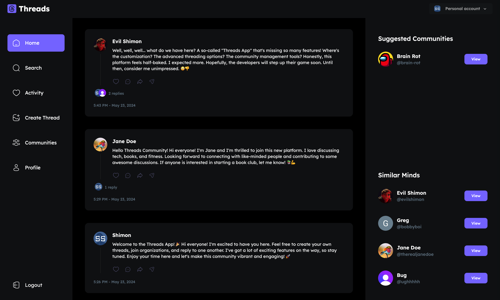

### Threads Clone App with Next.js, TypeScript, Shadcn, Svix, Clerk Auth, Tailwind CSS, Zod, MongoDB, and UploadThing

This project is a Threads clone application developed using a modern web stack including Next.js, TypeScript, Shadcn, Svix, Clerk Auth, Tailwind CSS, Zod, MongoDB, and UploadThing. The primary aim of this project was to create a functional and scalable social media platform, while deepening my understanding of these technologies and how they can be integrated to build a comprehensive application.

### Key Features:

- **Next.js**: Utilizes the latest features of Next.js for server-side rendering and static site generation, providing a performant and SEO-friendly application.
- **TypeScript**: Implements strong typing with TypeScript to enhance code quality and maintainability.
- **Shadcn**: Integrates Shadcn for component-based architecture, ensuring reusable and maintainable UI components.
- **Svix**: Uses Svix for real-time notifications and webhooks, enabling immediate updates and interactions within the app.
- **Clerk Auth**: Employs Clerk for user authentication and management, offering secure and easy-to-use authentication mechanisms.
- **Tailwind CSS**: Utilizes Tailwind CSS for styling, providing a modern, responsive, and customizable user interface with utility-first CSS.
- **Zod**: Implements Zod for schema validation, ensuring data integrity and validation throughout the application.
- **MongoDB**: Leverages MongoDB as the database to store and manage application data efficiently.
- **UploadThing**: Integrates UploadThing for seamless file and image uploads, allowing users to upload profile pictures and other media easily.

### Project Focus:

This project serves as a practical exercise in modern web development, focusing on:

- **Client vs. Server Components**: Understanding how to effectively use client and server components within Next.js to build a dynamic and responsive application.
- **Real-time Notifications and Webhooks**: Implementing real-time notifications and webhooks with Svix to enhance user interaction and engagement by providing immediate updates.
- **Authentication and Security**: Managing user authentication securely with Clerk Auth, ensuring safe and reliable user experiences.
- **Data Validation**: Ensuring data integrity with Zod, validating input data to prevent errors and improve application stability.
- **State Management**: Managing state effectively within a React application, handling CRUD operations and user interactions smoothly.
- **UI Design**: Utilizing Tailwind CSS to create a visually appealing and user-friendly interface, with a focus on responsiveness and customization.
- **File and Image Uploads**: Providing a seamless user experience for uploading files and images with UploadThing, enabling users to enhance their profiles and threads with media content.

Feel free to explore the code and experiment with the functionalities. Even better, visit my website, create an account, and start posting threads and joining communities. While there are still features under development, I am actively working on completing them, so stay tuned for updates. This project is a stepping stone towards building more complex applications and aims to solidify fundamental concepts in full-stack development.

